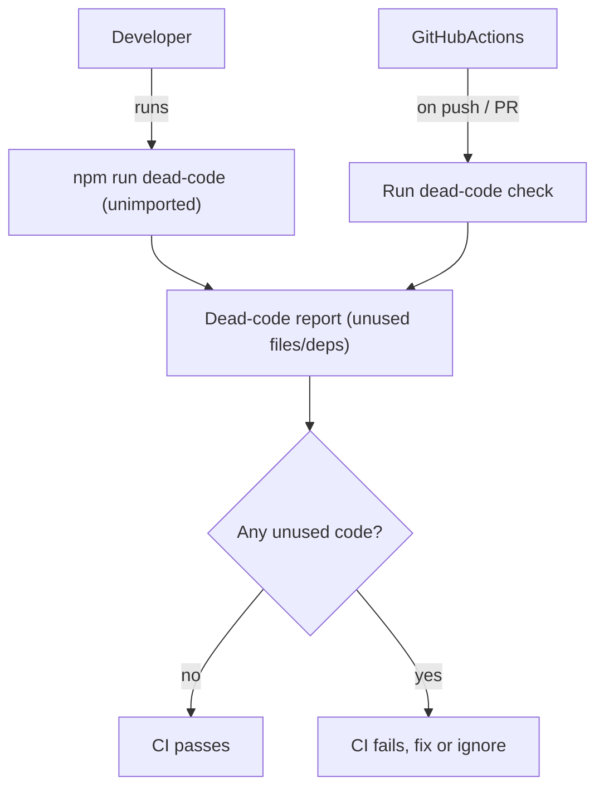

### High-level approach

- **Choose tool**: Use `unimported` as a Knip-like dead-code detector focused on unused files and dependencies for TypeScript/Next.js.
- **Wire into npm scripts**: Add an npm script to run dead-code analysis locally (`npm run dead-code`) without affecting existing workflows.
- **Integrate with CI**: Add or extend a GitHub Actions workflow to run the dead-code check in CI (non-pre-commit), failing on detected unused code.
- **Document usage**: Update `README` with quick instructions so contributors know how and when to use the tooling.

### Detailed steps

1. **Select and configure `unimported` for this codebase**

- Add `unimported` as a dev dependency in `[package.json](/Users/shakib/_workspace/projects/wise-checking/package.json)`.
- Create an `unimported` config file at `[unimported.config.mjs](/Users/shakib/_workspace/projects/wise-checking/unimported.config.mjs)` that:
  - Points `rootDir` to the project root and sets appropriate `entryFiles` for Next.js (for example `app/**/page.tsx`, `app/layout.tsx`, etc.).
  - Excludes Next.js/React-specific patterns and folders (e.g. `.next`, `node_modules`, possibly `prompts/` if not part of runtime code).
  - Marks known-intentional unused files (if any emerge later) via `ignorePatterns`.

1. **Expose a local dead-code script**

- Add an npm script in `package.json` such as:
  - `"dead-code": "unimported"` (or `"unimported --config ./unimported.config.mjs"` if needed explicitly).
- Ensure the script is independent of existing `lint` and `format` scripts so it can be run on-demand by maintainers.

1. **Wire dead-code checks into GitHub Actions CI**

- Inspect existing workflow `[.github/workflows/lint.yml](/Users/shakib/_workspace/projects/wise-checking/.github/workflows/lint.yml)`.
- Either:
  - Create a new workflow `[.github/workflows/dead-code.yml](/Users/shakib/_workspace/projects/wise-checking/.github/workflows/dead-code.yml)` dedicated to dead-code analysis, reusing the same checkout, Node setup, and install steps.
- Configure the job to fail if `unimported` reports unused files/dependencies, making this a CI-only guard as you requested.

1. **Document how to use dead-code tooling**

- Update `[README.md](/Users/shakib/_workspace/projects/wise-checking/README.md)` with a short section:
  - `npm run dead-code` for local checks.
  - Mention that CI runs the same command and will fail on unused files/deps.
  - Brief note on how to update `unimported.config.mjs` when adding intentional "unused" modules.

1. **(Optional) Future enhancements**

- Optionally add `ts-prune` later if you want even finer-grained unused-export checking.
- Consider a periodic scheduled CI workflow to run dead-code checks (e.g. weekly) if the repo grows.

### Simple flow diagram

